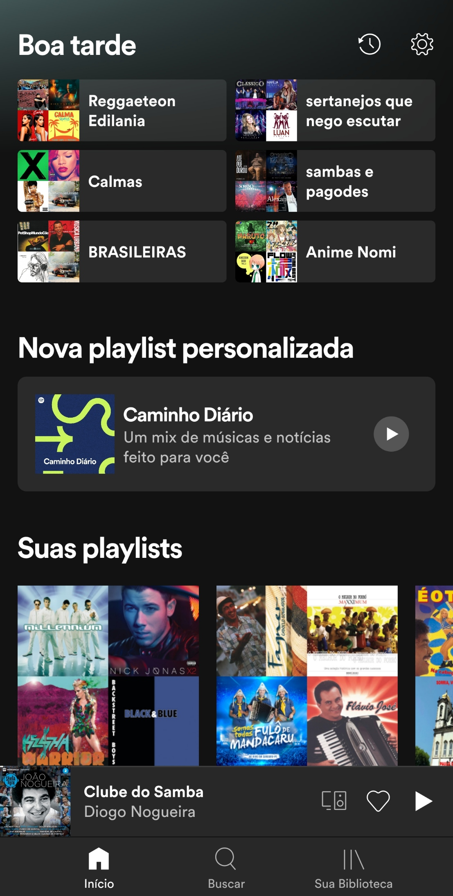
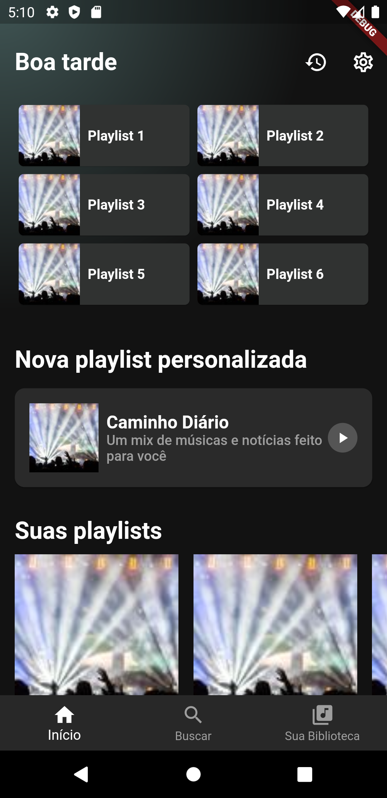

# Spotify SpeedCoding

Este repositório contém o código fonte do vídeo [Flutter - Spotify SpeedCoding](https://youtu.be/tnbFFzh7W8c) e ele visa implementar puramente o layout da tela inicial do aplicativo Spotity.

Este repositório não implementa nenhuma funcionalidade e também não possui nenhum tipo de patrocínio ou monetização.

|  |  |
| ------------------------------------------ | -------------------------------------------- |
| Original                                   | Resultado                                    |

<br />

## Executando o projeto

Para executar este projeto localmente, certifique-se de ter o Flutter instalado e configurado em seu computador/laptop.

A seguir, basta clonar o projeto e na raíz, executar os comandos:

```bash
flutter pub get
flutter run
```
